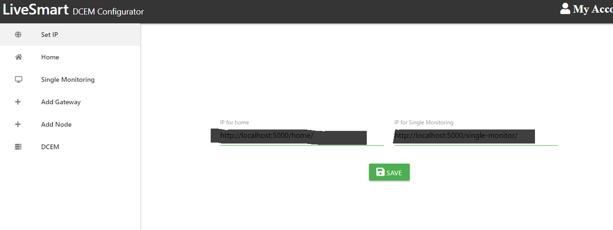

# Overview
The web/interface can be found at: https://peaceful-tor-77075.herokuapp.com/dcem/

Here use 

    https://peaceful-tor-77075.herokuapp.com/home/ 

as home ip and,

    https://peaceful-tor-77075.herokuapp.com/single-monitor/

as single - monitoring ip

use username: admin and password: admin as well

Or you can run it by using node locally along with server, (instruction in server section down...)


Then open the url shown in output, for example:


This will open 


use the username: admin, and password: admin for login.

# Server (For testing)
The server runs on node, please install latest npm if not already installed.
once installed, open terminal in server folder then run

    npm install
    npm app.js

This will output something like


Open the front-end url browser for frontend
here it is, but it ay be different in your case

    http://localhost:5000/dcem/


Note the Home and Single Monitor URLs from above, this values will be used for setting ips in the frontend for the first time

# Setup



Set the respective urls as ips here

# Usage
Server is used for two end-points

### 1. Home
It returns JSON like
```json
    {
        "Location":"LLLLL",
        "Device ID":"DDDDDDDDDDDDDDDDD",
        "Voltage":10.2,
        "Current":3.2717838634854015,
        "Alarm":"001000001",
        "Gateway":"GGGGGGGGGGGGGGGGG",
        "Temperature":34.3,
        "Code":"00"
    }
```

Click on Home in left menu of front end to see its output, only one device information (shown in red circle) is active and will play sound on any warning


### 2. Single Monitor
It returns JSON like
```json
    {
        "voltage":16.6,
        "current":5.165568013315286
    }
```

Click on Single Monitoring in left menu of front end then edit the amount of time you need the graph for in seconds to see its output, 


You can see the live updating graph


Once the graph is done plotting for the amount of time set, you can download the output in CSV format


